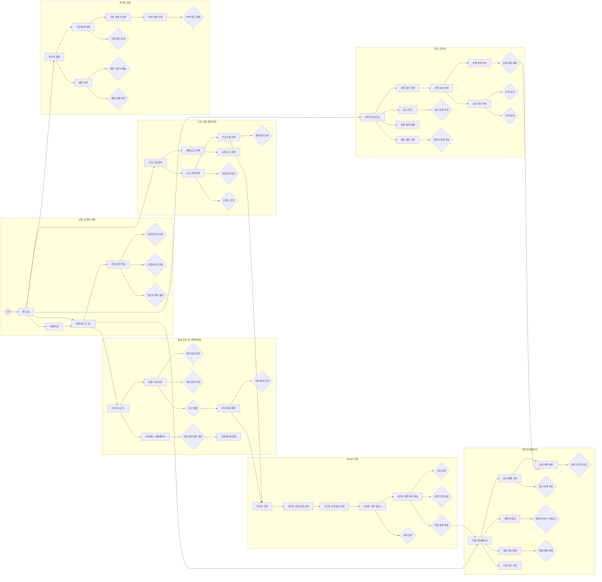

아래 작업 사이클과 규칙을 반드시 따릅니다.

## 작업 사이클
1. **Plan** — 서브에이전트를 만들어 `spec.md`를 작성시킨다. 사용자 승인을 받는다.
2. **Work** — 서브에이전트를 만들어 구현한다. 화면이 3개 이상이면 화면별로 서브에이전트를 나눈다.
3. **Review** — 서브에이전트를 만들어 테스트하고 `review.md`를 작성시킨다.
4. **Commit** — 기능마다 깃 커밋하고 깃허브에 푸시한다.

## 서브에이전트 규칙
- 서브에이전트에게 작업을 넘길 때 전용 지침 파일(.md)을 만들어 전달한다.
- 서브에이전트는 지침 파일에 명시된 범위만 수정한다.
- Work가 복잡하면 여러 서브에이전트로 나눈다. 각각 독립적으로 작업할 수 있게 범위를 겹치지 않게 나눈다.

## 규칙
- 승인 없이 구현을 시작하지 않는다.
- 막히면 사용자에게 알린다.
