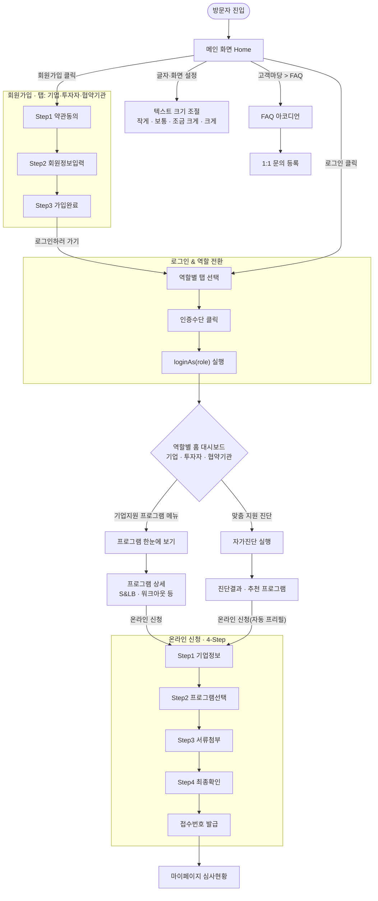
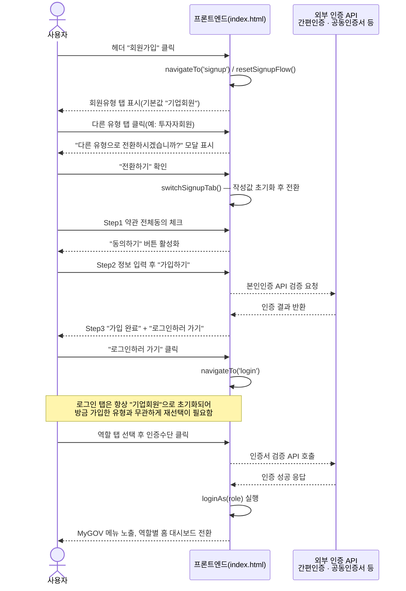
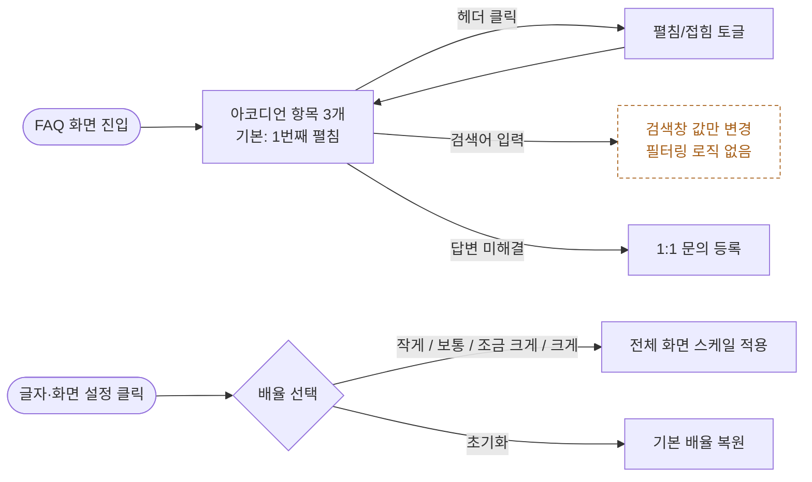
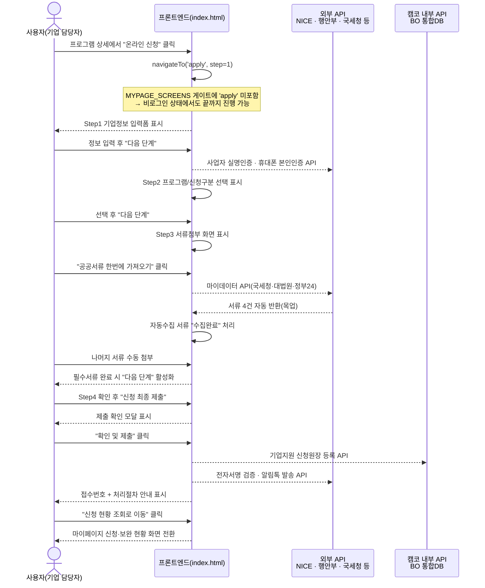

# 온기업(KAMCO) 사용자 흐름 분석 가이드

> 현재 저장소의 `index.html` 소스(라우팅 로직 · 화면 마크업 · `[연동]` 주석)를 직접 분석해 재구성한 유저플로우입니다. 각 단계를 **사용자 행동 → 시스템 반응**으로 분리하고, 코드상 미구현 API 연동 지점과 기획 보완이 필요한 구간을 함께 표시했습니다.

- **소스**: index.html (3,700+ lines)
- **구조**: 해시 라우터 기반 SPA — `#/<화면키>` 또는 `#/apply/<step>`
- **범위**: 진입/탐색 · 조회 · 신청 전환

---

## 00. 구조 개요

백엔드 없는 단일 HTML 안에 41개 화면(`data-screen`)을 모두 넣어두고, 해시 라우터로 전환하는 정적 프로토타입입니다.

| 함수 / 구조 | 역할 |
|---|---|
| `navigateTo(id, opts)` | `location.hash = '#/id'` 로 변경 → `hashchange` 이벤트 발생 |
| `handleRoute()` | 해시를 파싱해 `showScreen(id)` 호출, apply/admin 등 화면별 초기화 함수 실행 |
| `[data-goto]` 클릭 위임 | `document.body` 전역 리스너가 클릭을 가로채 로그인 게이트 확인 후 `navigateTo()` 호출 |

문서 전체에 등장하는 `<!-- [연동] ... -->` 주석 39곳은 실제 호출 코드가 아니라, **어디에 어떤 외부/내부 API를 붙여야 하는지 표시해 둔 설계 명세**입니다. 아래 다이어그램에서는 이 지점을 점선 화살표(`-->>`)로 표시합니다.

---

## 01. 진입 및 기본 탐색

메인 화면 진입 → 회원가입 → 상태 전환(로그인/역할) → 기업지원 프로그램 메뉴별 신청절차

| Step | 사용자 행동 | 시스템 반응 |
|---|---|---|
| 1 | **[CLICK]** URL 진입 / 새로고침 | **[SYS]** `handleRoute()`가 해시 없으면 `#/home`으로 고정, 홈 화면 노출 |
| 2 | **[CLICK]** 헤더 "회원가입" | **[SYS]** `signup` 화면 전환, `resetSignupFlow()` 실행 → 기본 탭 "기업회원", 3단계 스테퍼 초기화 |
| 3 | **[CLICK]** "투자자회원 / 협약기관" 탭 | **[SYS]** 작성 중이던 값이 있으면 "다른 유형으로 전환하시겠습니까?" 확인 모달 노출 → 확인 시 `switchSignupTab()`이 입력값 리셋 후 전환 |
| 4 | **[INPUT]** 약관 전체동의 체크 | **[SYS]** 필수 약관 3종 충족 시 "동의하기" 버튼 활성화 |
| 5 | **[INPUT]** 아이디·비밀번호·인증방식 입력 후 제출 | **[API]** 본인인증(간편인증/휴대폰) 검증 — *연동 예정*, 현재는 즉시 통과 처리 |
| 6 | **[CLICK]** "로그인하러 가기" | **[SYS]** `login` 화면 이동, 역할 탭은 항상 "기업회원"으로 초기화 (→ 04-D 참고) |
| 7 | **[CLICK]** 역할 탭 선택 후 인증수단(공동인증서 등) 클릭 | **[API]** 인증서/간편인증 검증 — *연동 예정* → **[SYS]** `loginAs(role)` 실행, MyGOV 메뉴 노출, 역할별 홈 대시보드 렌더 |
| 8 | **[CLICK]** 대시보드 "기업지원 프로그램 메뉴" | **[SYS]** 프로그램 개요 → 상세(S&LB·워크아웃 등) 화면으로 LNB 사이드 내비게이션과 함께 이동 |
| 9 | **[CLICK]** 프로그램 상세의 "온라인 신청" | **[SYS]** `data-prefill`로 프로그램명이 자동 채워진 채 신청 스테퍼(`apply`) Step 1로 이동 (03 참고) |

### FIG. 01 — 전체 사이트 여정 (진입 · 탐색 · 전환)

### FIG. 02 — 회원가입 → 로그인 → 역할 전환 상세 시퀀스

> **범례**: 실선(`->>`) = 현재 프론트엔드에서 실제 동작 / 점선(`-->>`) = 코드상 `[연동]` 주석으로만 존재(미구현)

---

## 02. 조회 및 정보 습득

FAQ 아코디언 확인 및 글자·화면 크기 조절 드롭다운 선택 — 별도 화면 전환 없이 같은 화면 안에서 상태만 바뀝니다.

| Step | 사용자 행동 | 시스템 반응 |
|---|---|---|
| 1 | **[CLICK]** 고객마당 > FAQ 메뉴 | **[SYS]** `board-faq` 화면 전환, 질문 검색창 + `krds-accordion` 3항목 노출 |
| 2 | **[CLICK]** 질문 헤더(예: "임시저장 보관기간") | **[SYS]** `aria-controls` 대상 패널이 펼침/접힘 토글(KRDS 아코디언 컴포넌트, 접근성 속성 자동 관리) |
| 3 | **[INPUT]** "질문 검색"에 키워드 입력 | **[API]** 실제 필터링 로직 없음 — *미구현 상태* (04-B 참고) |
| 4 | **[CLICK]** 헤더 "글자·화면 설정" 드롭다운 | **[SYS]** 작게 / 보통 / 조금 크게 / 크게 옵션 노출 |
| 5 | **[CLICK]** 크기 옵션 선택(예: "크게") | **[SYS]** `data-adjust-scale`를 KRDS 프레임워크(krds.min.js)가 읽어 전체 화면 배율(`scale`) 즉시 적용, "초기화"로 원복 가능 |

### FIG. 03 — 정보 조회 상태 다이어그램

---

## 03. 핵심 전환 플로우

온라인 신청 스테퍼(4단계) 진입 → 파일 업로드 → 최종 신청 완료. 이 사이트의 실질적 전환(Conversion) 지점입니다. `#stepper`와 `docsComplete()` 검증이 맞물려 진행됩니다.

| Step | 사용자 행동 | 시스템 반응 |
|---|---|---|
| 1 | **[CLICK]** "온라인 신청" 진입(직접 메뉴 또는 진단결과 프리필) | **[SYS]** `#/apply/1` 로 이동, Step1 "기업정보" 폼(상호·사업자번호·대표자·연락처) 표시 |
| 2 | **[INPUT]** 정보 확인 후 "다음 단계" | **[API]** 사업자 실명인증(NICE/KCB) · 휴대폰 본인인증 — *연동 예정* → **[SYS]** Step2 "프로그램 선택" 표시 |
| 3 | **[INPUT]** 신청 프로그램·구분 선택 후 "다음 단계" | **[SYS]** Step3 "서류 첨부" 표시, 필수서류 4종 자동수집 + 1종 수동첨부 목록 렌더 |
| 4 | **[CLICK]** "법인 인증 및 공공서류 한 번에 가져오기" | **[API]** 공공 마이데이터(국세청·대법원·정부24) 조회 — *연동 예정*, 현재는 1.2초 후 4종 문서를 "수집완료"로 목업 처리 |
| 5 | **[CLICK]** 나머지 서류(주주명부 등) "첨부하기" | **[SYS]** `data-uploaded="true"` 전환, `docsComplete()` 재계산 → 모두 충족 시 "다음 단계" 버튼 활성화 |
| 6 | **[CLICK]** Step4 진입 후 신청내용 확인 | **[SYS]** 프로그램명·상호·서류 완료건수 최종 요약 표시 |
| 7 | **[CLICK]** "신청 최종 제출" | **[SYS]** 제출 확인 모달 노출 |
| 8 | **[CLICK]** "확인 및 제출" | **[API]** 신청원장 등록(BO DB) · 전자서명 검증 · 알림톡 발송 — *연동 예정* → **[SYS]** 접수번호(KAMCO-2026-XXXXX) 발급, 처리절차 안내 표시 |
| 9 | **[CLICK]** "신청 현황 조회로 이동" | **[SYS]** 마이페이지 `mypage-status` 화면으로 전환 |

### FIG. 04 — 온라인 신청 4단계 상세 시퀀스 (API 연동 지점 포함)

> **범례**: 실선(`->>`) = 현재 프론트엔드에서 실제 동작 / 점선(`-->>`) = 코드상 `[연동]` 주석으로만 존재(미구현)

---

## 04. 기획 보완 제안

추측이 아니라 `index.html`의 실제 이벤트 리스너 / 조건문을 확인해 근거를 남긴 항목입니다.

**A. 로그인 게이트 누락 (우선순위 높음)**
비로그인 접근을 막는 `MYPAGE_SCREENS` 배열에 `'apply'`가 빠져 있어, 로그인하지 않은 방문자도 4단계 신청을 끝까지 진행해 접수번호를 발급받을 수 있습니다. 실명인증·전자서명 등 `[연동]` 지점은 모두 "인증된 사용자"를 전제로 설계돼 있어 논리적으로 모순됩니다.
`index.html:2917 (MYPAGE_SCREENS)`, `handleRoute()` 'apply' 분기

**B. FAQ 검색창 미작동**
`#faq-search` 입력창에 연결된 이벤트 리스너가 없어, 키워드를 입력해도 아무 필터링이 일어나지 않습니다. 검색 UI만 존재하는 죽은 기능입니다.
`index.html:2208`

**C. 주소 검색 버튼 미작동**
신청 Step1의 "주소 검색" 버튼(`#btn-address-search`) 역시 클릭 핸들러가 없어 반응하지 않습니다. 도로명주소 API 연동 주석은 있으나 버튼 자체가 죽어 있는 상태입니다.
`index.html:1522`

**D. 온보딩 연속성 끊김**
회원가입 완료 후 "로그인하러 가기"를 눌러도, 방금 선택한 회원 유형(투자자/협약기관)이 로그인 화면 탭에 이어지지 않고 항상 "기업회원" 탭이 기본 선택됩니다. 가입 직후 재선택이 필요한 불필요한 마찰입니다.
`index.html:609 (tab-role-company 기본 active)`

**E. 임시저장이 실제로 저장하지 않음**
"임시저장" 버튼은 토스트 메시지만 띄울 뿐 입력값을 어디에도 보관하지 않습니다. 새로고침하거나 다른 화면으로 이동 후 돌아오면 Step1~3 입력값이 모두 사라져, 설계 의도("이어 쓰기")가 실제로는 동작하지 않습니다.
`index.html:3195 (btn-save-draft)`

---
*ONKIUP UX FLOW SPEC · GENERATED FROM index.html STATIC ANALYSIS*
